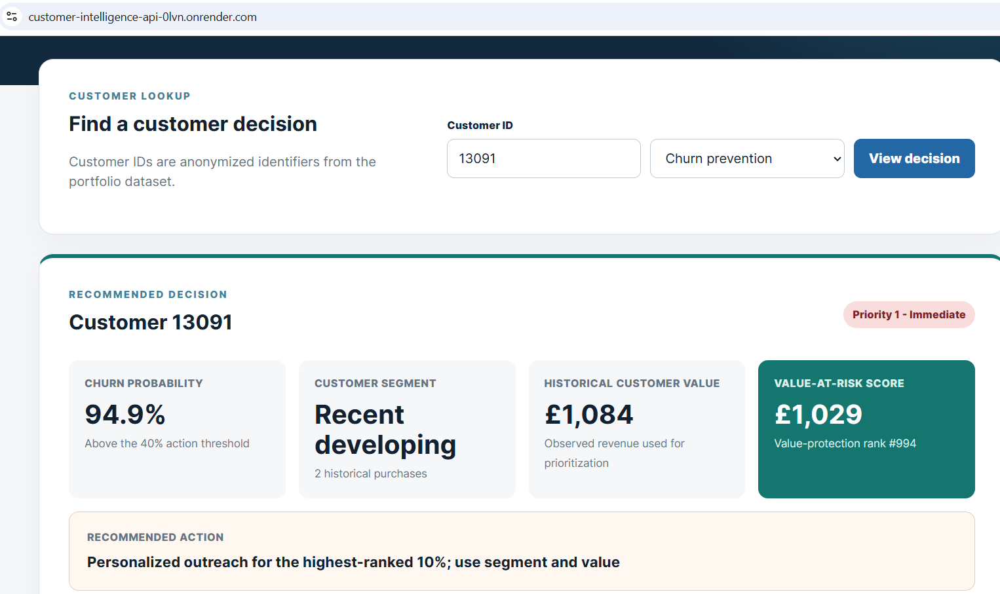
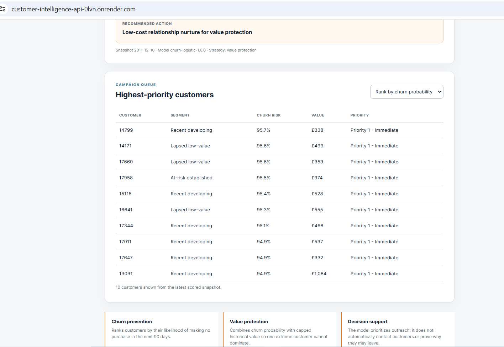
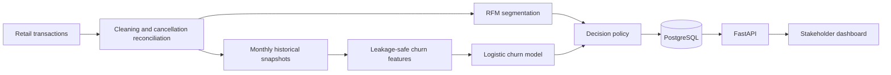
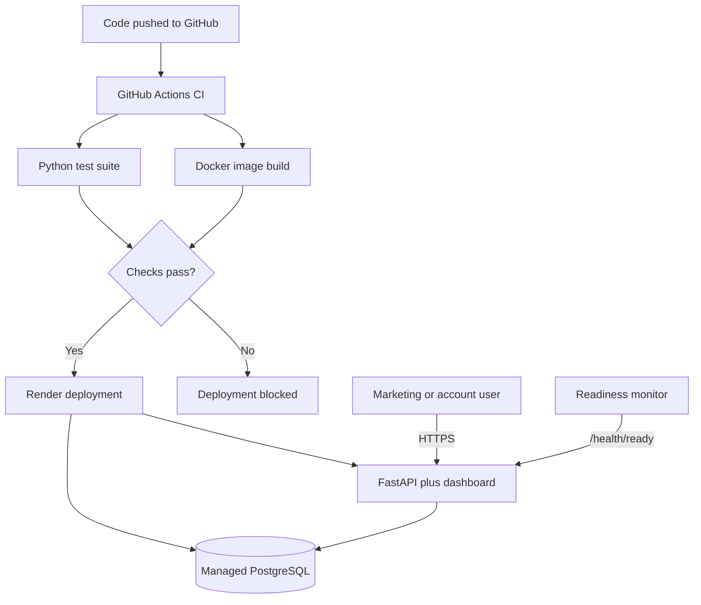

# Customer Intelligence System

### From 1.07 million retail transaction lines to targeted retention decisions

[](https://github.com/danyyen/customer_intelligence_system/actions/workflows/ci.yml)
[](https://customer-intelligence-api-0lvn.onrender.com/)
[](https://customer-intelligence-api-0lvn.onrender.com/docs)
[](https://www.python.org/)

**[Open the live decision dashboard](https://customer-intelligence-api-0lvn.onrender.com/)** | **[Explore the API](https://customer-intelligence-api-0lvn.onrender.com/docs)**

This end-to-end portfolio project turns raw purchase history into customer segments, predicts 90-day inactivity, prioritizes retention campaigns, and serves the results through a public decision dashboard and API.

It is designed around a practical business question:

> If a retention team cannot contact everyone, which customers should it contact first, why, and with what action?

## Business value

A churn probability alone does not tell a business what to do. This system connects four decisions:

| Business question | System capability | Stakeholder value |
|---|---|---|
| How do our customers behave differently? | Cancellation-aware RFM segmentation | Replace one-size-fits-all campaigns with segment-specific treatment |
| Who may become inactive? | Leakage-safe 90-day churn prediction | Identify risk before the next campaign window closes |
| Who should we contact with limited capacity? | Campaign-priority bands | Focus retention effort on the highest-ranked customers |
| Where is more customer value exposed? | Value-at-risk ranking | Give account teams a separate value-protection view |

The deployed dashboard lets a stakeholder search an anonymized customer, compare churn-prevention and value-protection strategies, and retrieve a recommended action without using Python.





> Hosted on Render's free tier: the first request after ~15 minutes idle can take up to a minute while the instance wakes.

## Results at a glance

### Segmentation

- **5,840 identified customers** organized into five actionable groups.
- **0.991 mean Adjusted Rand Index** across repeated K-Means runs, indicating highly stable assignments.
- A hybrid K-Means and DBSCAN design separates **82 exceptional high-value accounts** that would otherwise distort the general customer groups.
- Lifecycle validation changed the interpretation of the largest segment: **60.6% appeared only in the earlier dataset year**, so second-purchase activation is more suitable than a generic loyal-customer win-back message.


### Churn prediction

The selected logistic-regression model was evaluated on an untouched later-month holdout rather than a random test split.

| Untouched September test | Result | Plain-language meaning |
|---|---:|---|
| PR-AUC | **0.647** | Ranking quality for the churn class across possible thresholds |
| ROC-AUC | **0.759** | Ability to rank a churner above a non-churner |
| Lift at top 20% | **1.80x** | The highest-ranked fifth churned at 1.8 times the population rate |
| Precision at 20% capacity | **70.9%** | About 71 of every 100 contacted customers actually churned in the holdout |
| Recall at 20% capacity | **36.1%** | That campaign captured about 36% of all churners |

A shallow gradient-boosting challenger produced slightly higher one-month PR-AUC (0.655 versus 0.647), but logistic regression remained the champion because it had stronger repeated temporal validation, slightly better top-20% lift, a smaller campaign footprint, and clearer governance. This is a documented champion-challenger decision, not a claim that the more complex model is poor.

### Decision strategy

The API keeps two objectives separate:

- **Churn prevention** ranks primarily by churn probability and is the default when the goal is to reach more likely churners.
- **Value protection** combines churn probability with capped historical customer value when the goal is to protect commercially important relationships.

Historical value is capped only for ranking influence so a few wholesale-scale customers cannot dominate the full campaign list. Reported customer value remains uncapped. This metric is a prioritization proxy, **not expected profit or customer lifetime value**.

## How the system works



The model uses a **180-day observation window** to describe each customer's recent history, predicts whether the customer makes no purchase during the **next 90 days**, and repeats that setup across monthly historical snapshots. Features are built only from information available on or before each snapshot date.

## Deployment architecture



| Component | Responsibility |
|---|---|
| GitHub Actions | Runs tests and proves the Docker image builds after every push |
| Docker | Packages the API, dependencies, approved model, and frontend consistently |
| Render | Builds and hosts the public web service over HTTPS |
| PostgreSQL | Persists scored customer decisions independently of API restarts |
| FastAPI | Exposes model metadata, predictions, decision lists, and health endpoints |
| Dashboard | Converts API output into a stakeholder-friendly interface |

Render deploys only after the linked CI checks pass. `/health/live` confirms that the web process responds; `/health/ready` additionally confirms that the model loaded and PostgreSQL is reachable.

See the detailed **[deployment architecture and operating guide](docs/deployment-architecture.md)**, [Docker guide](docs/docker.md), and [Render guide](docs/render.md).

## Segmentation methodology

### 1. Create an auditable transaction population

The preparation layer:

- classifies numeric invoices as sales, `C` invoices as cancellations, and `A` invoices as accounting adjustments;
- removes bad debt, postage, fees, test records, and other non-merchandise lines;
- keeps excluded populations measurable instead of silently treating them as errors;
- excludes missing customer IDs only when customer-level modelling begins;
- retains legitimate zero-price promotional items.

### 2. Reconcile cancellations before calculating RFM

Filtering to positive quantities alone can overstate value. One observed customer placed an 80,995-unit order worth GBP 168,469.60 and reversed it 12 minutes later.

The primary pipeline uses chronological FIFO lot matching: a later cancellation consumes the oldest visible earlier sale quantity for the same customer and product. It cannot consume a future purchase or more quantity than appears inside the data window.

A price-compatible closest-prior policy was implemented as a sensitivity check. It changed at least one RFM value for 9.18% of customers but moved aggregate Monetary by only 0.249%. FIFO remains the primary policy because it is deterministic and does not rely on an unaudited assumption that cancellation prices always identify the original lot.

### 3. Build and validate RFM

- **Recency:** days since the latest retained purchase.
- **Frequency:** distinct invoices containing retained purchase quantity.
- **Monetary:** retained quantity multiplied by original sale price.

Frequency and Monetary are log-transformed and scaled for distance-based clustering. Original units are preserved for stakeholder profiles. K-Means was assessed using inertia, silhouette score, cluster balance, business usefulness, and repeated-seed stability. DBSCAN supplied an independent density-based view of exceptional accounts.

## The five customer segments

| Segment | Customers | Share | Typical customer (median) | Suggested action |
|---|---:|---:|---|---|
| **Champions** | 1,186 | 20.3% | 17 days, 12 orders, GBP 4,557 | VIP retention, early access, and priority service |
| **Exceptional high-value** | 82 | 1.4% | 28 days, 23 orders, GBP 18,164 | Named-account management and individual review |
| **At-risk established** | 1,427 | 24.4% | 185 days, 4 orders, GBP 1,437 | Timely personalized win-back |
| **Recent developing** | 1,208 | 20.7% | 24 days, 3 orders, GBP 707 | Nurture toward the next purchase |
| **Lapsed low-value** | 1,937 | 33.2% | 402 days, 1 order, GBP 273 | Second-purchase activation rather than loyalty messaging |

Medians describe the typical customer without being distorted by unusually large accounts.


## Churn methodology

1. Analyze customer interpurchase gaps to define candidate inactivity horizons.
2. Create monthly snapshots using 180 days of historical information.
3. Label churn from the following 90 days, keeping future information out of features.
4. Purge overlapping periods between development and evaluation windows.
5. Establish a transparent recency-rule baseline.
6. Compare regularized logistic regression with tree-based challengers.
7. Tune model settings and the 0.40 decision threshold using historical validation only.
8. Evaluate once on the untouched September cohort.
9. Convert probabilities into campaign-capacity and value-protection decisions.
10. Package the complete preprocessing and model contract as one versioned artifact.

| Notebook | Purpose |
|---|---|
| [01 - Customer segmentation](notebooks/01_customer_segmentation.ipynb) | Clean transactions and build validated behavioural segments |
| [02 - Churn definition](notebooks/02_churn_definition.ipynb) | Select observation and prediction windows; create labels |
| [03 - Feature engineering](notebooks/03_churn_feature_engineering.ipynb) | Build leakage-safe customer features at each snapshot |
| [04 - Baseline and validation](notebooks/04_churn_baseline_and_validation.ipynb) | Establish the recency baseline and chronological validation |
| [05 - Logistic regression](notebooks/05_churn_logistic_regression.ipynb) | Train, tune, interpret, and evaluate the linear model |
| [06 - Tree challengers](notebooks/06_churn_tree_models.ipynb) | Run the champion-challenger comparison |
| [07 - Risk bands and capacity](notebooks/07_churn_risk_bands_and_capacity.ipynb) | Translate scores into operational campaign policies |

## API capabilities

| Endpoint | Purpose |
|---|---|
| `GET /` | Stakeholder decision dashboard |
| `GET /health/live` | Confirm the API process is responding |
| `GET /health/ready` | Confirm the model and database are ready |
| `GET /v1/model` | Return model version and time-window metadata |
| `POST /v1/predict` | Score one already-engineered feature record |
| `GET /v1/customers/{id}` | Retrieve the latest decision for one customer |
| `GET /v1/customers` | Filter and rank the latest customer decision list |

## Repository structure

```text
customer_intelligence_system/
|-- customer_intelligence/
|   |-- data_prep.py              # Shared transaction preparation
|   |-- segmentation/             # Cancellation-aware RFM and clustering
|   |-- churn/                    # Labels, features, models, validation, decisions
|   `-- api/                      # FastAPI, PostgreSQL access, and dashboard
|-- notebooks/                   # Analysis from segmentation to campaign policy
|-- scripts/                     # Reproducible batch and packaging commands
|-- tests/                       # Segmentation, churn, API, storage, deployment tests
|-- data/processed/              # Versioned outputs used by downstream stages
|-- models/                      # Approved packaged model artifact
|-- docs/                        # Policy, Docker, Render, and architecture guides
|-- images/                      # Portfolio figures
|-- .github/workflows/ci.yml     # Automated test and Docker-build gate
|-- Dockerfile                   # Production image definition
|-- compose.yaml                 # Local API, bootstrap, and PostgreSQL stack
|-- render.yaml                  # Cloud infrastructure blueprint
`-- pyproject.toml               # Installable package definition
```

## Run locally with Docker

```bash
docker compose up --build
```

Then open:

- Dashboard: `http://localhost:8000/`
- Swagger API: `http://localhost:8000/docs`
- Readiness: `http://localhost:8000/health/ready`

Stop while preserving the local database volume:

```bash
docker compose down
```

## Reproduce the analytical pipeline

Requires Python 3.12 or newer.

```bash
python -m venv .venv
pip install -r requirements-dev.txt
pip install -e .
python -m pytest -q -p no:cacheprovider
```

Download `online_retail_II.xlsx` from the [UCI Online Retail II dataset](https://archive.ics.uci.edu/dataset/502/online+retail+ii) and place it at:

```text
uci data/online_retail_II.xlsx
```

The raw workbook is intentionally not committed. Core outputs can be rebuilt with the scripts in `scripts/`; the notebooks contain the exploratory evidence and decision narrative.

## Engineering and governance choices

- **Chronological validation:** future months never train models evaluated on earlier months.
- **Purged boundaries:** rows whose outcomes overlap the holdout are excluded from training.
- **Packaged preprocessing:** transformations and the model travel together to reduce training-serving skew.
- **Transactional publication:** the API sees either the previous complete decision snapshot or the new complete snapshot, never a partial load.
- **Typed API contracts:** malformed prediction requests fail before reaching scikit-learn.
- **Non-root container:** the API runs without unnecessary operating-system privileges.
- **CI deployment gate:** tests and Docker build checks must pass before Render deploys.
- **Explicit model versioning:** responses identify the model that produced each decision.

## Limitations and responsible use

- This is a public portfolio deployment using anonymized historical data, not a live commercial system.
- The free Render web service can sleep when idle, so the first request may be slower. Its free PostgreSQL instance is temporary and has no production backup guarantee.
- The public demonstration API has no end-user authentication. Real customer data would require identity, role-based authorization, rate limiting, audit logs, privacy controls, and a private data pipeline.
- Churn means no purchase within the chosen 90-day horizon; it is an operational definition, not proof that a customer permanently left.
- Predictions identify association, not the cause of inactivity or the causal effect of an offer.
- Value at risk uses historical revenue, not margin, future customer lifetime value, or incremental profit.
- Campaign actions should be tested with controlled experiments before claiming financial impact.
- Cancellation matching is a reproducible analytical approximation, not audited invoice reconciliation.

## Roadmap

| Stage | Outcome | Status |
|---|---|---|
| Customer segmentation | Five validated, actionable behavioural groups | Complete |
| Churn prediction | Chronologically validated 90-day risk model | Complete |
| Decisioning | Capacity-aware and value-aware campaign priorities | Complete |
| Deployment | Dockerized FastAPI, PostgreSQL, dashboard, CI/CD, health checks | Complete |
| GenAI assistant | Grounded explanations of approved customer decisions | Next |

The planned GenAI layer will explain retrieved model outputs and policies; it will not invent customer facts or replace the approved churn model.

## Technology

Python, pandas, NumPy, scikit-learn, FastAPI, Pydantic, SQLAlchemy, PostgreSQL, Docker, GitHub Actions, Render, HTML, CSS, JavaScript, Matplotlib, Seaborn, and Jupyter.

## Data source

[UCI Online Retail II](https://archive.ics.uci.edu/dataset/502/online+retail+ii) contains transactions from a UK-based online retailer between December 2009 and December 2011. The dataset is distributed under [CC BY 4.0](https://creativecommons.org/licenses/by/4.0/).
