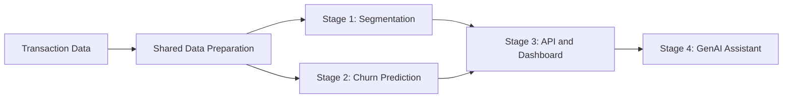
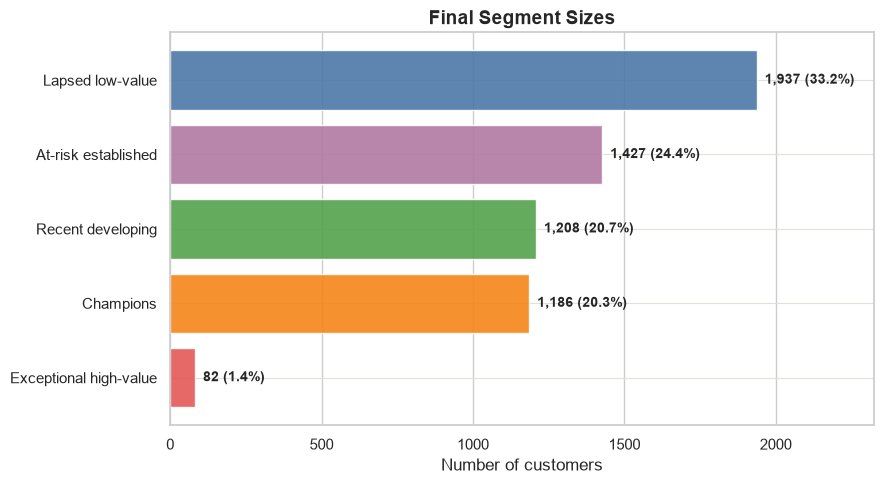
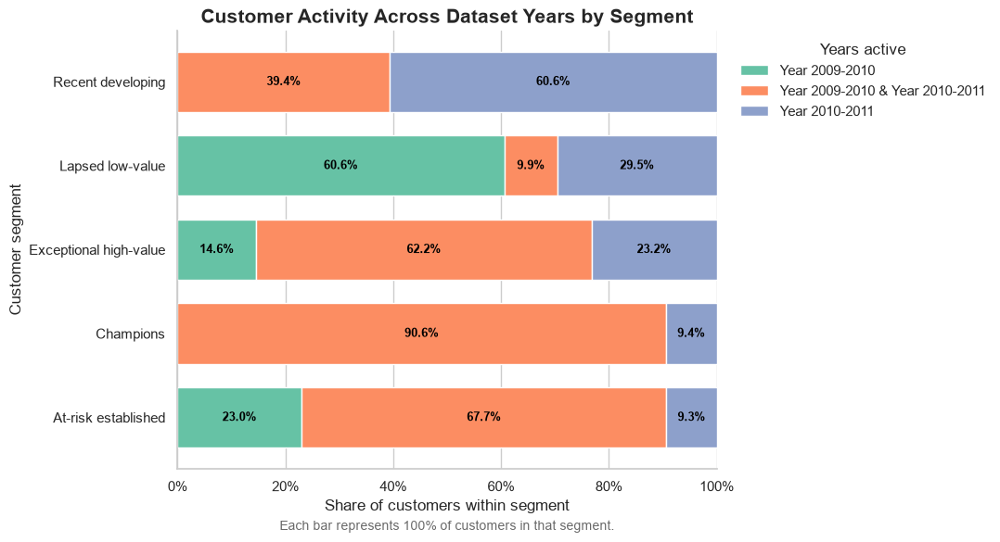
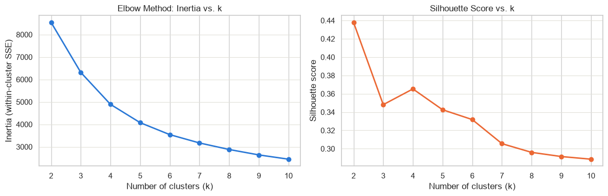
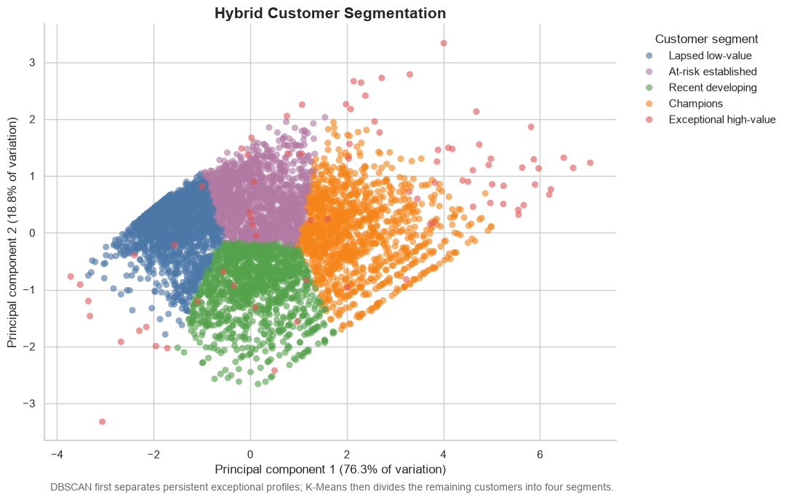

# Customer Intelligence System

## Project Roadmap

| Stage | Purpose | Status |
|---|---|---|
| 1. Customer segmentation | Describe current customer behaviour |  Complete |
| 2. Churn prediction | Predict future customer inactivity |  Next |
| 3. Deployment | Serve segments and risk predictions |  Planned |
| 4. GenAI assistant | Explain results and support decisions |  Planned |



## Repository Structure

```text
customer_intelligence_system/
├── customer_intelligence/
│   ├── data_prep.py                 # Shared transaction preparation
│   └── segmentation/
│       ├── rfm.py                   # Cancellation reconciliation and RFM
│       ├── clustering.py            # Scaling, K-Means and DBSCAN
│       └── viz.py                   # Shared visualization settings
├── notebooks/
│   └── 01_customer_segmentation.ipynb
├── tests/
│   └── segmentation/                # Cleaning and RFM unit tests
├── data/
│   └── processed/
│       └── customer_segments.csv     # Stage 1 output for downstream stages
├── scripts/
│   ├── build_segmentation_table.py   # Rebuild the segmentation output
│   └── export_readme_images.py
├── images/                           # Figures used in this README
├── pyproject.toml                    # Package metadata and dependencies
├── requirements.txt                  # Reproducible notebook environment
└── README.md
```

The root `customer_intelligence` package is intentionally broader than segmentation. Future stages will add `churn`, `serving`, and `genai` modules alongside the completed segmentation package, while reusing the shared preparation layer. Planned folders are added only when working code exists, so the repository always reflects implemented functionality.

## Stage 1 — Customer Segmentation

This completed stage transforms transaction history into actionable customer groups using cancellation-aware RFM feature engineering, K-Means, and DBSCAN.

> Turning 1.07 million retail transaction lines into five customer groups a marketing or account team can actually use.

[View Stage 1: Customer Segmentation](notebooks/01_customer_segmentation.ipynb)



## The business question

Who should this retailer retain, nurture, reactivate, or manage individually?

A single campaign for every customer wastes money: a recent first-time buyer, a fading repeat customer, and a wholesale-scale account do not need the same message. This project uses purchasing behaviour—not unavailable demographic assumptions—to build segments with distinct commercial actions.

## What the data covers

The analysis uses [UCI Online Retail II](https://archive.ics.uci.edu/dataset/502/online+retail+ii), two years of transactions from a UK-based online gift retailer between December 2009 and December 2011.

- **1,067,371** raw invoice lines
- **820,647** customer-attributed merchandise rows after cleaning
- **5,840** identified customers with at least one retained purchase
- Approximately **241,000 unidentified transaction rows** excluded from customer-level modelling

The source data is licensed under [CC BY 4.0](https://creativecommons.org/licenses/by/4.0/).

## The five customer segments

| Segment | Customers | Share | Typical customer | Recommended action |
|---|---:|---:|---|---|
| **Champions** | 1,186 | 20.3% | 17 days since purchase · 12 orders · £4,557 value | VIP retention, early access and priority service |
| **Exceptional high-value** | 82 | 1.4% | 28 days · 23 orders · £18,164 | Named-account management and individual review |
| **At-risk established** | 1,427 | 24.4% | 185 days · 4 orders · £1,437 | Timely, personalized win-back |
| **Recent developing** | 1,208 | 20.7% | 24 days · 3 orders · £707 | Nurture genuinely new customers toward their next purchase |
| **Lapsed low-value** | 1,937 | 33.2% | 402 days · 1 order · £273 | Second-purchase activation rather than loyalty messaging |

Values above are segment medians, so they describe the typical customer without being distorted by a few very large accounts.

## The finding that changes the campaign

The largest segment initially looks like a standard group of churned customers. A lifecycle check tells a more useful story: **60.6% appear only in the earlier year of data, and the typical customer placed just one order**.

Most were not loyal customers who later left—they never progressed beyond an initial purchase. Calling them “lapsed loyalists” would lead to the wrong campaign. A second-purchase or onboarding sequence is more credible than a generic “we miss you” message.

The same check revealed two audiences inside Recent developing:

- **60.6% are genuinely new**, making onboarding and next-purchase incentives appropriate.
- **39.4% have been present across both years but remain casual**, suggesting lower natural growth potential.



## Methodology

### 1. Build a customer-ready transaction population

The cleaning process:

- classified numeric invoices as sales, `C` invoices as cancellations, and `A` invoices as accounting adjustments;
- removed bad-debt entries, postage, fees, test records and other non-merchandise lines;
- preserved excluded populations for audit rather than silently deleting them;
- excluded missing customer IDs only when moving to customer-level modelling;
- retained legitimate zero-price promotional products.

### 2. Reconcile cancellations before calculating RFM

A positive-only filter can badly overstate customer value. One observed customer placed an **80,995-unit, £168,469.60 order and cancelled it 12 minutes later**.

The primary pipeline therefore uses chronological FIFO lot matching:

1. Every sale opens a quantity lot for that customer and product.
2. A later cancellation consumes the oldest available earlier lot.
3. A cancellation cannot consume a future purchase or more quantity than is visible.
4. Only remaining quantities contribute to customer value.

The implementation was checked against seven synthetic cases covering partial cancellations, complete reversals, orphan cancellations, price changes and timestamp ties. A price-compatible closest-prior method was also built as a sensitivity comparison. The methods differ for 9.18% of customers but change aggregate customer value by only 0.249%; FIFO remains the documented primary assumption.

### 3. Engineer and prepare RFM features

- **Recency:** days since the latest retained purchase
- **Frequency:** distinct invoices containing retained purchase quantity
- **Monetary:** retained quantity multiplied by its original sale price

Frequency and Monetary were extremely right-skewed, so the model uses `log1p` transformation followed by standard scaling. The original values remain untouched for business reporting.

### 4. Segment and validate

- K-Means was evaluated for `k=2` through `k=10` using inertia, silhouette score, cluster size and business interpretability.
- `k=4` was selected because it produced four balanced, actionable groups; `k=2` was statistically cleaner but too broad for campaign use.
- Repeated K-Means runs produced a **mean pairwise Adjusted Rand Index of 0.991** and a minimum of **0.983**, indicating highly stable structure across initializations.
- DBSCAN provided a density-based second opinion and consistently surfaced a small population of exceptional accounts.
- The final hybrid separates 82 persistent DBSCAN outliers, then fits four K-Means segments to the remaining customers.



For a technical view of the final groups in principal-component space:



## Why this is more than a clustering demo

The project does not stop at coloured points. It includes:

- auditable cleaning decisions;
- explicit handling of returns and partial cancellations;
- known-answer synthetic tests;
- an alternative reconciliation policy;
- transformation and capping sensitivity checks;
- model-selection and initialization-stability analysis;
- lifecycle and geography checks before assigning business labels;
- actions tied to measured segment behaviour.

## Limitations

- Results describe identified customers only; transactions without a customer ID cannot be assigned to a customer history.
- FIFO is a reproducible approximation because cancellation rows do not contain a documented original-invoice reference. It should not be treated as audited invoice reconciliation.
- DBSCAN noise represents unusual behaviour, not automatically erroneous data. The exceptional segment remains heterogeneous and warrants individual account review.
- The hybrid model reduces upper-tail distortion, but its segments still require validation against a future outcome or campaign response before claiming causal business impact.
- RFM summarizes observed purchasing behaviour; it does not explain why a customer behaved that way or predict churn by itself.

## Reproduce the analysis

### 1. Clone the repository and create an environment

Requires **Python 3.12+** — `requirements.txt` pins the exact versions this notebook was run and verified against (pandas 3.0, numpy 2.4), which need a recent Python to install.

```bash
python -m venv .venv
```

Activate it, then install the dependencies:

```bash
pip install -r requirements.txt
```

### 2. Download the data

Download `online_retail_II.xlsx` from the [UCI dataset page](https://archive.ics.uci.edu/dataset/502/online+retail+ii) and place it here:

```text
uci data/online_retail_II.xlsx
```

### 3. Run the segmentation pipeline

```bash
python scripts/build_segmentation_table.py
```

Open [Stage 1: Customer Segmentation](notebooks/01_customer_segmentation.ipynb) and run all cells from top to bottom. The cancellation-matching comparisons process the complete transaction history and may take several minutes.

## Tools

Python · pandas · NumPy · Matplotlib · Seaborn · scikit-learn · Jupyter
