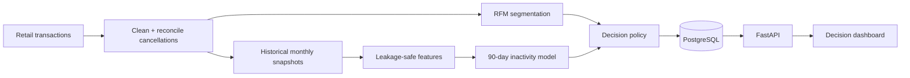
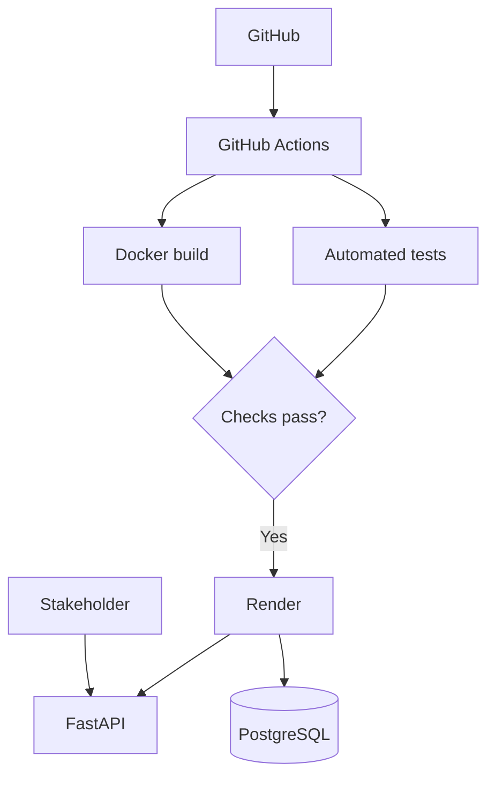

# Customer Intelligence System

### From 1.07M transaction lines to a deployed retention decision system

[](https://github.com/danyyen/customer_intelligence_system/actions/workflows/ci.yml)
[](https://customer-intelligence-api-0lvn.onrender.com/)
[](https://customer-intelligence-api-0lvn.onrender.com/docs)

**Python · scikit-learn · FastAPI · PostgreSQL · Docker · GitHub Actions**

A churn score is not a business decision.

This system turns retail purchase history into customer segments, **90-day inactivity risk**, ranked campaign priorities, and stakeholder-facing actions—then serves those decisions through a deployed API and dashboard.

The decision problem is simple:

> **If a retention team cannot contact everyone, which customers should it contact first, why, and with what action?**

## Results at a glance

| Decision evidence | Result |
|---|---:|
| Transaction lines analyzed | **1.07M** |
| Identified customers | **5,840** |
| Segmentation stability — mean ARI | **0.991** |
| Untouched holdout PR-AUC | **0.647** |
| Untouched holdout ROC-AUC | **0.759** |
| Lift at top 20% | **1.80×** |
| Precision at 20% campaign capacity | **70.9%** |
| Recall at 20% campaign capacity | **36.1%** |

At a 20% outreach capacity, the highest-ranked fifth of customers achieved **70.9% precision and 1.80× lift** on the untouched later-month holdout.

The selected logistic model was not simply the model with the highest single score. A shallow gradient-boosting challenger produced slightly higher one-month PR-AUC (**0.655 vs. 0.647**), but logistic regression remained the champion because it showed stronger repeated temporal validation, slightly better top-20% lift, a smaller campaign footprint, and clearer governance.

That tradeoff is intentional: model selection is a decision-design problem, not a leaderboard exercise.

## What the system does


```mermaid
flowchart LR
    A[Retail transactions] --> B[Clean + reconcile cancellations]
    B --> C[RFM segmentation]
    B --> D[Historical monthly snapshots]
    D --> E[Leakage-safe features]
    E --> F[90-day inactivity model]
    C --> G[Decision policy]
    F --> G
    G --> H[(PostgreSQL)]
    H --> I[FastAPI]
    I --> J[Decision dashboard]
```

The model observes the previous **180 days** of customer behaviour and predicts whether the customer makes no purchase during the **following 90 days**. Every feature is restricted to information available at the prediction date.

## The part that mattered most: validation design

Customer behaviour changes over time. A random split can make a retention model look stronger than it will be when asked to score future customers.

I therefore built the evaluation around time:

1. create monthly historical customer snapshots;
2. build features using only information available at each snapshot;
3. label inactivity from the following 90 days;
4. purge overlapping development/evaluation windows;
5. compare against a transparent recency-rule baseline;
6. tune using historical validation only; and
7. evaluate once on an untouched later-month cohort.

This makes the reported performance much closer to the real question: **could this model have ranked customers using only what was known at the time?**

## Segmentation: useful groups, not just clusters

RFM features capture:

- **Recency** — days since latest retained purchase;
- **Frequency** — distinct invoices containing retained purchase quantity; and
- **Monetary** — retained quantity × original sale price.

K-Means is evaluated on separation, balance, business usefulness, and repeated-seed stability. A DBSCAN view separately identifies **82 exceptional high-value accounts** that would otherwise distort the broader customer groups.

One result changed the business interpretation materially: **60.6% of the largest segment appeared only in the earlier dataset year**. That evidence shifts the likely intervention away from generic win-back messaging toward understanding second-purchase activation and lifecycle behaviour.

## Transaction preparation before modeling

The source data contains more than clean purchases. The preparation layer therefore:

- classifies sales, cancellations, and accounting adjustments;
- removes bad debt, postage, fees, test records, and other non-merchandise lines;
- keeps excluded populations measurable rather than silently deleting them;
- excludes missing customer IDs only when customer-level modeling begins; and
- preserves legitimate zero-price promotional items.

Cancellations are reconciled before RFM is calculated. The primary pipeline uses chronological FIFO lot matching so a later cancellation consumes visible earlier sale quantity for the same customer/product without consuming future purchases.

This prevents downstream segmentation and churn features from treating reversed purchases as genuine customer value.

## From probability to action

The system separates two legitimate retention objectives:

**Churn prevention** ranks primarily by inactivity probability when the goal is to reach customers most likely to become inactive.

**Value protection** combines inactivity probability with capped historical value when commercially important relationships deserve additional prioritization.

The cap limits ranking influence only; reported customer value remains uncapped. The score is a prioritization mechanism—not expected profit and not customer lifetime value.

## Deployment


```mermaid
flowchart TB
    Dev[GitHub] --> CI[GitHub Actions]
    CI --> Tests[Automated tests]
    CI --> Build[Docker build]
    Tests --> Gate{Checks pass?}
    Build --> Gate
    Gate -->|Yes| Render[Render]
    Render --> API[FastAPI]
    Render --> DB[(PostgreSQL)]
    User[Stakeholder] --> API
```

The deployed application exposes model metadata, predictions, customer decisions, ranked campaign lists, and health endpoints. PostgreSQL persists scored decisions independently of API restarts.

**[Open the live decision dashboard](https://customer-intelligence-api-0lvn.onrender.com/)** · **[Explore the API](https://customer-intelligence-api-0lvn.onrender.com/docs)**

## Repository structure

```text
customer_intelligence/
    data_prep.py          transaction preparation
    segmentation/        RFM + clustering
    churn/               labels, features, validation, models + decisions
    api/                 FastAPI, database access + dashboard
notebooks/               analytical workflow
scripts/                 reproducible batch + packaging commands
tests/                   automated tests
docs/                    deployment + operating documentation
models/                   versioned model artifacts
.github/workflows/        CI workflow
Dockerfile                application image
compose.yaml              local service composition
render.yaml               deployment configuration
```

## Choices I would defend in an interview

**Why predict inactivity instead of calling it churn?** The observed target is no purchase in the next 90 days. Calling that permanent churn would claim more than the data establishes.

**Why temporal validation?** The production problem is future ranking. Validation should reproduce that information boundary rather than mix past and future customers randomly.

**Why keep logistic regression when boosting had slightly higher holdout PR-AUC?** A single metric was not the deployment objective. Stability across time, top-capacity lift, campaign footprint, interpretability, and governance also mattered.

**Why separate risk from customer value?** A high probability of inactivity and high commercial value are different concepts. Combining them invisibly makes the score difficult to govern or explain.

**Why deploy the decision layer?** A notebook proves analysis. An API, persistence layer, CI pipeline, and stakeholder interface demonstrate how analytical output becomes something another system or team can actually use.

## Responsible interpretation

- The target is **90-day inactivity**, not proof of permanent churn.
- The model ranks risk; it does not establish why a customer becomes inactive.
- Historical customer value is not customer lifetime value.
- The public deployment demonstrates the architecture using anonymized historical data; it is not connected to a live commercial customer system.
- Incremental retention impact requires a controlled experiment before revenue can be attributed to model-driven outreach.

---

**What this repository demonstrates:** decision-focused data science, leakage-aware temporal validation, segmentation, interpretable model selection, API deployment, persistence, CI/CD, and translating model output into an operational policy.
