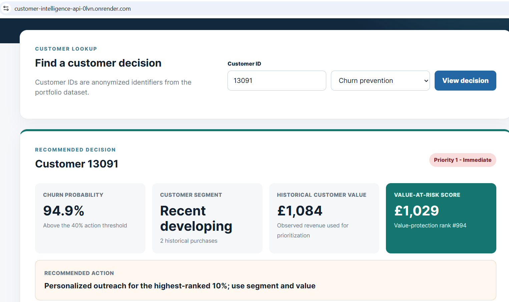
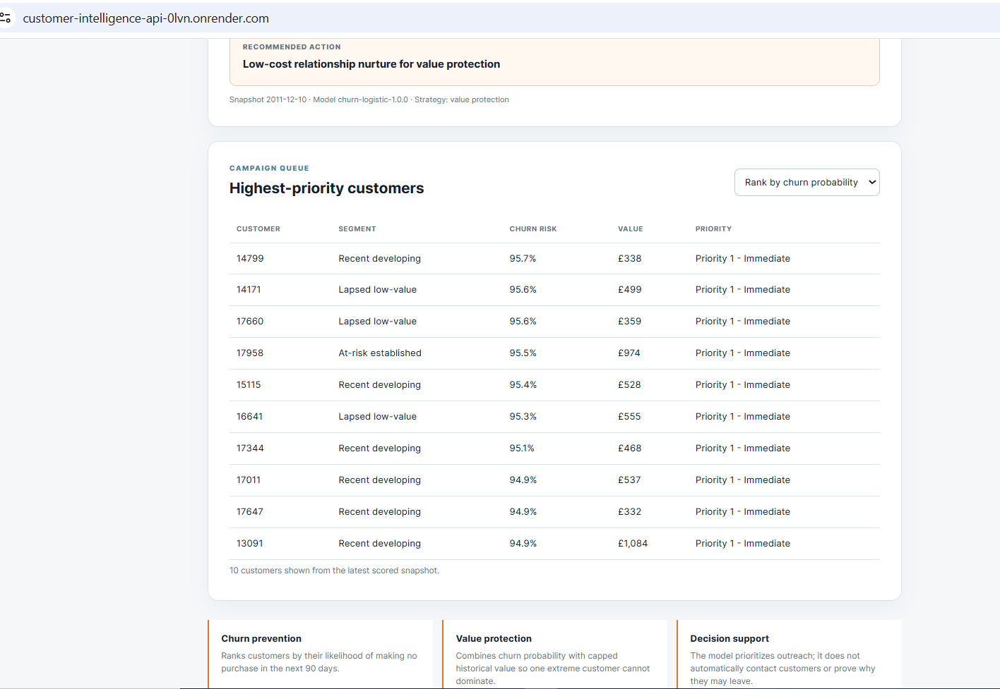
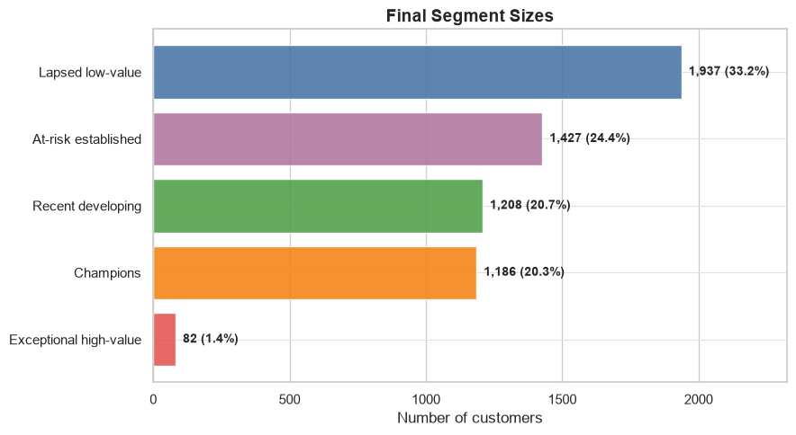
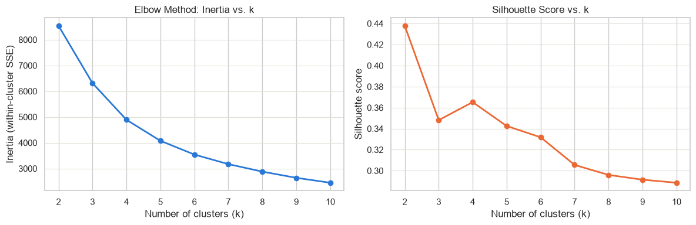

# Customer Intelligence System

### From 1.07 million retail transaction lines to targeted retention decisions

This system turns retail purchase history into customer segments, 90-day inactivity risk scores, campaign priorities, and stakeholder-facing decisions served through a deployed API and dashboard.

The business question is straightforward:

> **If a retention team cannot contact everyone, which customers should it contact first, why, and with what action?**

  

## Results at a glance

| Outcome | Result |
|---|---:|
| Identified customers | **5,840** |
| Stable segmentation | **0.991 mean ARI** |
| Exceptional high-value accounts isolated | **82** |
| Holdout PR-AUC | **0.647** |
| Holdout ROC-AUC | **0.759** |
| Lift at top 20% | **1.80×** |
| Precision at 20% campaign capacity | **70.9%** |
| Recall at 20% campaign capacity | **36.1%** |

At 20% campaign capacity, the highest-ranked fifth of customers achieved **70.9% precision and 1.80× lift** on the untouched holdout.

  

## Customer segmentation that changes the action

The segmentation layer is not just descriptive. It changes which retention action makes sense.

- **5,840 identified customers** are organized into five behavioural groups.
- **0.991 mean Adjusted Rand Index** across repeated K-Means runs indicates highly stable assignments.
- A hybrid K-Means and DBSCAN design separates **82 exceptional high-value accounts** that would otherwise distort the general customer groups.
- Lifecycle validation showed that **60.6% of the largest segment appeared only in the earlier dataset year**, changing the recommended treatment from generic win-back messaging to second-purchase activation.

  

The point is not to label customers. It is to connect customer behaviour to a different commercial action.

## 90-day inactivity prediction

The selected logistic-regression model was evaluated on an untouched later-month holdout rather than a random split.

| Untouched September test | Result |
|---|---:|
| PR-AUC | **0.647** |
| ROC-AUC | **0.759** |
| Lift at top 20% | **1.80×** |
| Precision at 20% capacity | **70.9%** |
| Recall at 20% capacity | **36.1%** |

A shallow gradient-boosting challenger produced slightly higher one-month PR-AUC (**0.655 vs 0.647**). Logistic regression remained the champion because it had stronger repeated temporal validation, slightly better top-20% lift, a smaller campaign footprint, and clearer governance.

  

That tradeoff matters: the selected model was not simply the one with the highest single headline metric.

## Decision framework

A probability score alone does not tell a retention team what to do. The system separates two objectives:

- **Inactivity prevention:** rank primarily by inactivity probability when the goal is to reach more likely inactive customers.
- **Value protection:** combine inactivity probability with capped historical customer value when commercially important relationships require separate attention.

Historical value is capped only for ranking influence. Reported customer value remains uncapped. This is a prioritization proxy, not expected profit or customer lifetime value.

## System architecture

~~~mermaid
flowchart LR
    A[Retail transactions] --> B[Cleaning and cancellation reconciliation]
    B --> C[RFM segmentation]
    B --> D[Monthly historical snapshots]
    D --> E[Leakage-safe features]
    E --> F[Logistic model]
    C --> G[Decision policy]
    F --> G
    G --> H[(PostgreSQL)]
    H --> I[FastAPI]
    I --> J[Decision dashboard]
~~~

The model uses a **180-day observation window** and predicts whether a customer makes no purchase during the **following 90 days**. Features are built only from information available on or before each snapshot date.

## Why the validation design matters

Customer behaviour is time-dependent. A random train/test split can produce an overly optimistic result if later behavioural patterns leak into earlier evaluation periods.

This project therefore uses:

- monthly historical snapshots;
- chronological validation;
- purged overlapping windows;
- an untouched later-month holdout; and
- model selection based on ranking quality and campaign-capacity performance rather than accuracy alone.

This is one of the strongest parts of the project because it makes the model evaluation closer to the decision the business would actually face.

## Transaction preparation

The preparation layer:

- classifies sales, cancellations, and accounting adjustments;
- removes bad debt, postage, fees, test records, and other non-merchandise lines;
- keeps excluded populations measurable instead of silently discarding them;
- excludes missing customer IDs only when customer-level modeling begins; and
- retains legitimate zero-price promotional items.

Cancellations are reconciled before RFM is calculated. The primary pipeline uses chronological FIFO lot matching so a later cancellation consumes visible earlier sale quantity for the same customer and product without consuming future purchases.

## Modeling workflow

1. Analyze interpurchase gaps to define candidate inactivity horizons.
2. Create monthly snapshots using 180 days of historical information.
3. Label inactivity from the following 90 days without using future information as features.
4. Purge overlapping periods between development and evaluation windows.
5. Establish a transparent recency-rule baseline.
6. Compare regularized logistic regression with tree-based challengers.
7. Tune model settings and decision thresholds using historical validation only.
8. Evaluate once on the untouched September cohort.
9. Convert probabilities into campaign-capacity and value-protection decisions.
10. Package preprocessing and model logic as a versioned artifact.

## Deployment

~~~mermaid
flowchart TB
    Dev[GitHub] --> CI[GitHub Actions]
    CI --> Tests[Tests]
    CI --> Build[Docker build]
    Tests --> Gate{Checks pass?}
    Build --> Gate
    Gate -->|Yes| Render[Render]
    Render --> API[FastAPI]
    Render --> DB[(PostgreSQL)]
    API --> DB
    User[Stakeholder] --> API
~~~

The deployed application exposes model metadata, predictions, customer decisions, ranked campaign lists, and health endpoints. PostgreSQL persists scored decisions independently of API restarts.

## Repository structure

~~~text
customer_intelligence/
    data_prep.py          Shared transaction preparation
    segmentation/        RFM and clustering
    churn/               Labels, features, validation, models and decisions
    api/                 FastAPI, database access and dashboard
notebooks/               Analysis from segmentation through campaign policy
scripts/                 Reproducible batch and packaging commands
tests/                   Automated tests
docs/                    Deployment and operating documentation
models/                  Versioned model artifacts
.github/workflows/       CI workflow
Dockerfile               Application image
compose.yaml              Local service composition
render.yaml               Deployment configuration
~~~

## Responsible interpretation

- The target is **90-day inactivity**, not proof that a customer has permanently churned.
- The model estimates ranking risk; it does not establish why a customer becomes inactive.
- Historical customer value is not customer lifetime value.
- The public deployment demonstrates the system architecture using anonymized historical data; it is not connected to a live commercial customer system.
- Retention impact should be measured with controlled experiments before attributing incremental revenue to model-driven outreach.

---

**What this repository demonstrates:** applied data science, leakage-safe temporal validation, customer segmentation, model governance, decisioning under campaign constraints, API deployment, database integration, Docker, CI/CD, and stakeholder-facing delivery.
