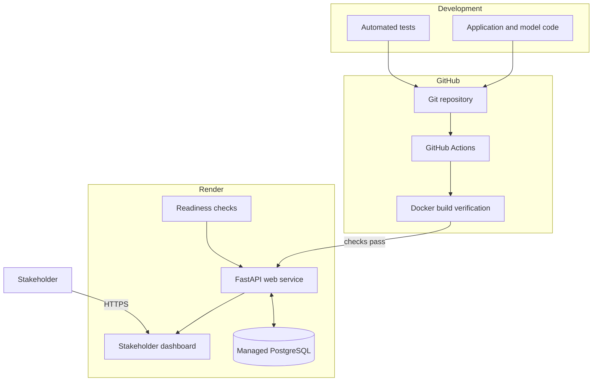

# Deployment architecture and operating guide

## Purpose

This document explains how an approved churn model becomes a usable customer
decision service. It separates analytical training, batch scoring, persistent
storage, online serving, and presentation so each responsibility can be tested
and changed independently.

## Production-style architecture

## Two different flows

### Deployment flow

1. A developer pushes a commit to GitHub.
2. GitHub Actions installs the project and runs the automated tests.
3. A separate CI job builds the production Docker image.
4. Render deploys only after the linked checks pass.
5. The cloud launcher publishes the verified decision snapshot.
6. FastAPI starts only if publication succeeds.
7. Render calls `/health/ready` before treating the deployment as ready.

This flow answers: **Can this version be deployed safely?**

### Request flow

1. A stakeholder opens the dashboard over HTTPS.
2. FastAPI serves the HTML, CSS, and JavaScript.
3. The browser requests a customer decision from a versioned `/v1` endpoint.
4. The repository layer queries the latest complete snapshot in PostgreSQL.
5. FastAPI validates and serializes the response.
6. The browser displays churn risk, value at risk, priority, and action.

This flow answers: **How does a user receive a decision?**

The online request does not rebuild features or retrain the model. Expensive,
auditable analytics remain in the batch workflow, while the API performs fast
reads from the serving database.

## Component responsibilities

### GitHub Actions

The workflow in `.github/workflows/ci.yml` provides two independent gates:

- Python tests protect analytical and application behavior.
- Docker build verification protects deployment packaging.

Independent jobs make failures easier to diagnose. CI proves reproducibility;
it does not prove that a hosted service or external database is reachable.

### Docker image

The `Dockerfile` packages only what the API needs: application code, minimal
runtime dependencies, the approved model artifact, and the verified portfolio
decision snapshot. Raw workbooks, notebooks, tests, and virtual environments
are excluded.

The service runs as a non-root Linux user. The image uses the same startup path
locally and in the cloud, reducing environment-specific behavior.

### Cloud startup

`customer_intelligence.api.cloud_start` performs two ordered operations:

1. Transactionally publish the verified decisions to PostgreSQL.
2. Start the HTTP server.

If publication fails, the API does not start. This fail-closed behavior avoids
presenting an apparently healthy dashboard backed by missing decision data.

The startup bootstrap is a free-tier portfolio compromise. A mature production
system would use versioned schema migrations and a separate scheduled scoring
or pre-deployment job.

### PostgreSQL serving store

PostgreSQL persists customer decisions outside the replaceable API container.
Each publication records a run identifier, snapshot date, model version,
status, row count, and timestamps. Publishing one snapshot happens inside a
single transaction, so readers never see a partially loaded campaign list.

Render supplies the private database connection through `DATABASE_URL`. The
credential is generated by the platform and is not stored in Git.

### FastAPI service

FastAPI loads the packaged model once during application startup. Pydantic
schemas define the HTTP contract and reject malformed inputs before they reach
the model. SQLAlchemy isolates business queries from the specific database
connection.

The API exposes two distinct health signals:

- `/health/live`: the Python web process can answer a request.
- `/health/ready`: the model is loaded and the database answers a query.

Liveness should stay lightweight. Readiness is the correct routing check
because accepting traffic without the model or database would not be useful.

### Stakeholder dashboard

The dashboard is served by the same FastAPI origin and calls the documented
API endpoints. This avoids an additional service and cross-origin configuration
for the current project. A larger product could move to an independently
deployed frontend when separate release cycles become valuable.

## Configuration

| Variable | Purpose | Local default |
|---|---|---|
| `APP_ENV` | Identifies the running environment | `development` |
| `CHURN_MODEL_PATH` | Location of the approved model artifact | `models/churn_logistic_v1.joblib` |
| `DATABASE_URL` | SQLAlchemy database connection | local SQLite outside Compose |
| `PORT` | HTTP listening port | `8000` |

Local Docker Compose supplies PostgreSQL and its development-only password.
Render supplies a managed private connection string. Production credentials
must never be copied into `.env`, source code, screenshots, or logs.

## Reliability and safety controls

- Automated tests cover data preparation, labels, features, validation,
  decision policy, packaged model behavior, database publication, API
  contracts, and deployment configuration.
- CI must pass before an automatic Render deployment.
- Database publication is atomic.
- The SQLAlchemy engine checks pooled connections before reuse.
- Readiness confirms critical dependencies.
- The model version is returned with decisions for traceability.
- Docker runs the service without root privileges.
- The managed database is not exposed through a public allow list.

## Current security boundary

The hosted service uses anonymized public portfolio data, so it is intentionally
accessible for demonstration. It must not be treated as a template for exposing
real customer records publicly.

Before using real data, add:

- organization identity and single sign-on;
- role-based authorization;
- rate limiting and abuse controls;
- audit logs for decision access;
- encryption and retention policies;
- private data ingestion and artifact storage;
- secret rotation and vulnerability scanning;
- consent and applicable privacy governance.

## Operations checklist

### After every deployment

1. Confirm GitHub CI is green.
2. Confirm Render reports a successful deployment.
3. Request `/health/live`.
4. Request `/health/ready` and verify the expected model version.
5. Request `/v1/model` and check the observation and prediction horizons.
6. Retrieve at least one customer under each strategy.
7. Open the dashboard and verify the campaign queue.

### If deployment fails

Diagnose the first failing layer instead of repeatedly redeploying:

1. **CI test failure:** inspect the failing Python test.
2. **Docker build failure:** inspect dependency, copy, or Dockerfile errors.
3. **Startup failure:** inspect the bootstrap and Uvicorn logs.
4. **Readiness failure:** check model loading and database connectivity.
5. **Request failure:** check API validation, storage query, and browser logs.

### Rollback principle

If a new release fails readiness, Render should retain or restore the last
healthy deployment. Model artifacts and decision policies must be versioned so
the team can identify exactly which behavior is being restored.

## Free-tier trade-offs

The current deployment is optimized for portfolio demonstration rather than a
production service-level agreement:

- the web service can sleep while idle and have a slow first request;
- the free PostgreSQL database is temporary and has no production backup;
- startup republishes a bundled decision snapshot;
- the service runs a single web process;
- there is no authenticated user boundary.

A production evolution would use persistent PostgreSQL, versioned migrations,
scheduled scoring, controlled object storage, authentication, monitoring and
alerting, backup recovery tests, multiple instances, and measured service-level
objectives.
